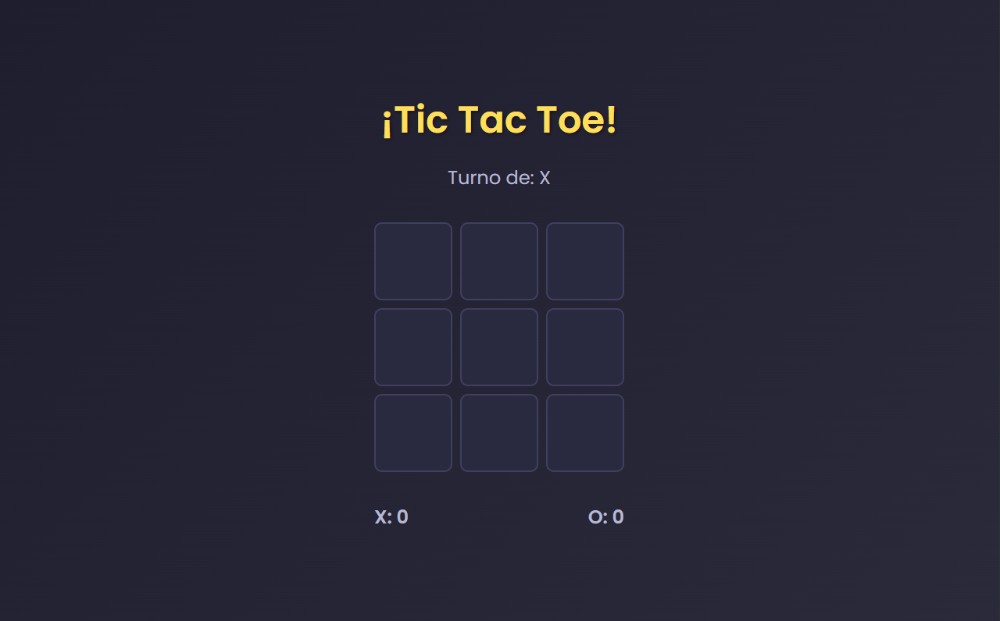

# Tic Tac Toe 🕹️

¡Bienvenido a este divertido juego de Tic Tac Toe! Este proyecto está diseñado con HTML, CSS y JavaScript.

## Captura de Pantalla



## Características

- **Interfaz moderna y responsiva**
- **Gestión de turnos**
- **Detección de ganadores y empate**
- **Animaciones visuales**

## Cómo Ejecutarlo

1. Clona el repositorio

```bash
git clone https://github.com/lucasnbarbero/tic-tac-toe.git
cd tic-tac-toe
```

2. Abre `index.html` en un navegador o usa un servidor local:

```bash
npx serve .
```

## Créditos

Desarrollador por **Lucas**, desarrollador Frontend 🚀
